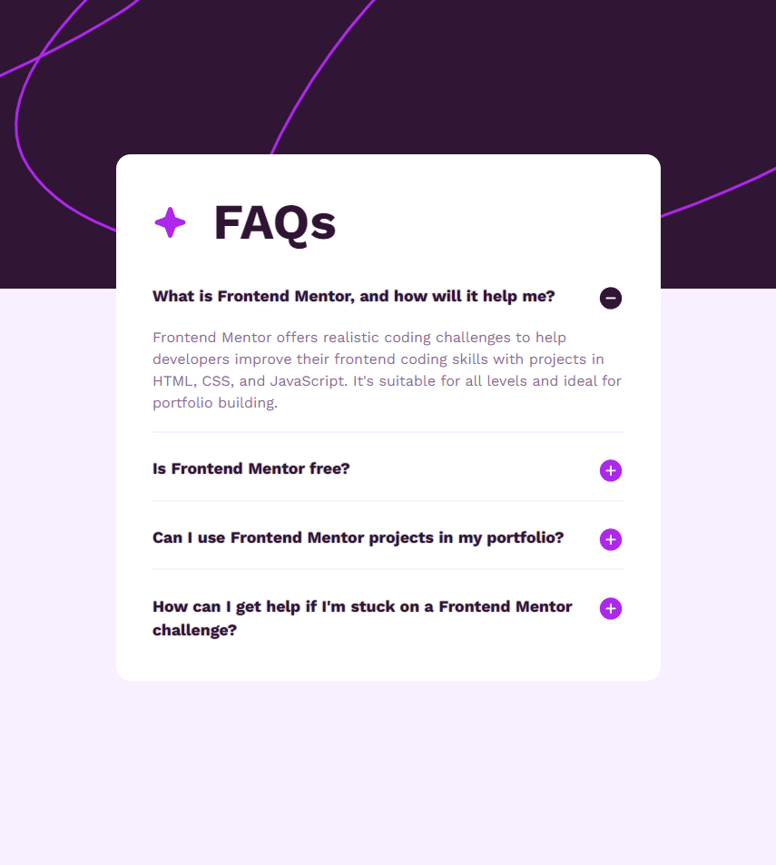

# Frontend Mentor - FAQ accordion solution

This is a solution to the [FAQ accordion challenge on Frontend Mentor](https://www.frontendmentor.io/challenges/faq-accordion-wyfFdeBwBz). Frontend Mentor challenges help you improve your coding skills by building realistic projects. 

## Table of contents

- [Overview](#overview)
  - [The challenge](#the-challenge)
  - [Screenshot](#screenshot)
  - [Links](#links)
- [My process](#my-process)
  - [Built with](#built-with)
  - [What I learned](#what-i-learned)
- [Author](#author)
- [Acknowledgments](#acknowledgments)

## Overview

### The challenge

Users should be able to:

- Hide/Show the answer to a question when the question is clicked
- Navigate the questions and hide/show answers using keyboard navigation alone
- View the optimal layout for the interface depending on their device's screen size
- See hover and focus states for all interactive elements on the page

----

### Screenshot

### Links

- [Solution on FM](https://www.frontendmentor.io/solutions/responsive-faq-accordion-BrMdCoC9If)
- [Live site](https://l3laze.github.io/Frontend-Mentor-Solutions/FAQ-Accordion/index.html)

## My process

### Built with

- Semantic HTML5 markup
- CSS custom properties
- Flexbox

### What I learned

It's extremely annoying trying to build to the design based on a blurry JPG. Hard to tell if some of the text has a shadow or if it's just aliasing.

## Author

- Frontend Mentor - [@l3laze](https://www.frontendmentor.io/profile/l3laze)

## Acknowledgments

Thanks to Frontend Mentor's own accordion in their help section. Despite the obfuscated CSS it was still worth inspecting with dev tools.
