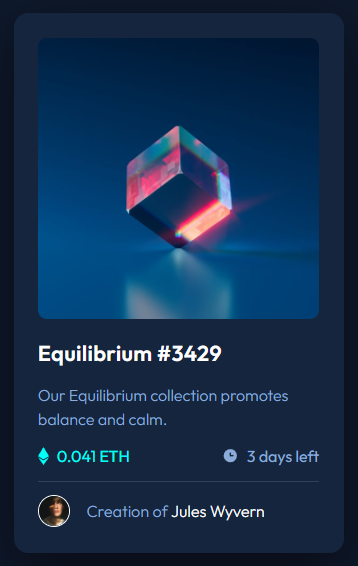

# Frontend Mentor - NFT preview card component solution

This is a solution to the [NFT preview card component challenge on Frontend Mentor](https://www.frontendmentor.io/challenges/nft-preview-card-component-SbdUL_w0U). Frontend Mentor challenges help you improve your coding skills by building realistic projects. 

## Table of contents

- [Overview](#overview)
  - [The challenge](#the-challenge)
  - [Screenshot](#screenshot)
  - [Links](#links)
- [My process](#my-process)
  - [Built with](#built-with)
  - [What I learned](#what-i-learned)
- [Author](#author)
- [Acknowledgments](#acknowledgments)

## Overview

### The challenge

Users should be able to:

- View the optimal layout depending on their device's screen size
- See hover states for interactive elements

----

### Screenshot

### Links

- [Solution on FM](https://www.frontendmentor.io/solutions/htmlcss-nft-preview-card-component-T6IeadK_MF)
- [Live site](https://l3laze.github.io/Frontend-Mentor-Solutions/NFT-Preview-Card-Component/index.html)

## My process

### Built with

- HTML5 markup, as semantic as possible.
- CSS custom properties.
- Flexbox.
- Only one vertical margin!

### What I learned

* Should've looked up the image hover overlay with icon solution and explanation faster than I did.

* Flexbox is almost always > vertical margin.

## Author

- Frontend Mentor - [@l3laze](https://www.frontendmentor.io/profile/l3laze)

## Acknowledgments

Thanks to [Stack Overflow](https://stackoverflow.com/questions/54508374/how-can-i-position-an-icon-over-an-image-or-video) and [W3CSS ](https://www.w3schools.com/howto/howto_css_image_overlay_icon.asp) for "image overlay icon" solution and explanation.
